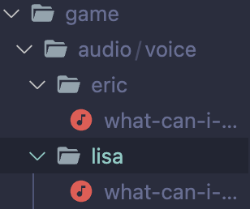
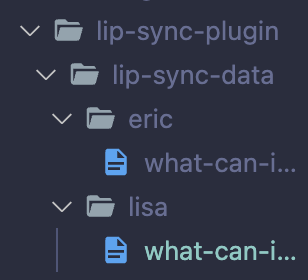

# Lip Sync Plugin for Ren'Py

Enhance your Ren'Py visual novel experience with the Lip Sync Plugin, integrating lip-sync animations seamlessly using the Rhubarb Lip Sync tool.


## ⭐️ Key Feature

### 1. Asynchronous Lip-Sync

Synchronize lip animations with voice-over lines for immersive storytelling.

### 2. User-Driven Termination

Seamlessly terminate voice-over and lip-sync upon user interaction (e.g., skipping dialogue) for uninterrupted gameplay.

## ⚙️ Installation

### 1. Download Rhubarb Lip Sync

- Begin by downloading the suitable version of `Rhubarb Lip Sync` from the [official repository](https://github.com/DanielSWolf/rhubarb-lip-sync/releases) that corresponds to your operating system.
  - If you are on macOS, ensure you select the macOS version.

### 2. Copy Plugin Directory

- To incorporate the plugin into your Ren'Py project, copy the entire `lip-sync-plugin` directory from this repository and place it within your project's main directory.

### 3. Add Rhubarb Executable

- Inside the `lip-sync-plugin` directory, insert the downloaded `Rhubarb Lip Sync` executable file.
- Replace the existing version of Rhubarb-Lip-Sync with your new one.

### 4. Prepare Audio Files

- For your project's voice-over audio files, arrange them in the `audio/voice` directory.
- 🚨 Important: Ensure that these audio files are in the `.wav` or `.ogg` format.

### 5. Generate Lip Sync Data

Execute the `generate_lipsync_data.py` script located in the `lip-sync-plugin` directory. This script generates lip-sync data files for your audio files in the `lip-sync-data` subdirectory.
Run the following code in the `lip-sync-plugin` directory:

```bash
python3 generate_lipsync_data.py
```

After execution, observe the generated subdirectories and files in the lip-sync-data directory:




## 🎮 Integration

## Integrate Lip Sync Animations

With the lip-sync data files prepared, proceed to integrate lip-sync animations into your game using the provided template:

```renpy
define lisa = Character("lisa", color="#ffffff")

layeredimage lisa:
    zoom 3.0
    group mouth:
        attribute mouth_A:
            "lisa-A.png"
        attribute mouth_B:
            "lisa-B.png"
        attribute mouth_C:
            "lisa-C.png"
        attribute mouth_D:
            "lisa-D.png"
        attribute mouth_E:
            "lisa-E.png"
        attribute mouth_F:
            "lisa-F.png"
        attribute mouth_G:
            "lisa-G.png"
        attribute mouth_H:
            "lisa-H.png"
        attribute mouth_X default:
            "lisa-X.png"

# Note: Lip-sync requires audio files in .wav format.
# Note: Prepare lip-sync data using generate_lipsync_data.py.

label start:
    # show lisa at left
    show lisa at center
    "Hello, I'm lisa."
    "Watch me lip-sync."
    # Play the lip-sync animation for the given audio file.
    # parameters are : character, audio file, text to display
    $ lipsync(lisa, "what-can-i-do-for-you-npc-british-male-99751.wav", "What can I do for you?")
    $ lipsync(lisa, "ah-good-morning-sir-would-you-like-a-cup-of-tea.ogg", \
        "Ah, good morning sir. Would you like a cup of tea?")
    "Thank you for watching!"
```

### 🚨 Note
- Reference the mouth shapes in the images directory for accuracy.
- https://github.com/DanielSWolf/rhubarb-lip-sync#mouth-shapes

## 📜 Licensing

- The Lip Sync Plugin for Ren'Py is licensed under the [MIT License](LICENSE).

- This plugin is powered by the third-party Rhubarb Lip Sync tool, which is also licensed under the [MIT License](https://github.com/DanielSWolf/rhubarb-lip-sync/blob/master/LICENSE).

## 🙌 Contributions and Updates

Contribute to the Lip Sync Plugin for Ren'Py by forking and submitting pull requests for improvements, bug fixes, or new features. Report issues on our GitHub Issues page, and we'll address them promptly. Expect regular updates for an improved lip-sync experience in your visual novels! 🚀
